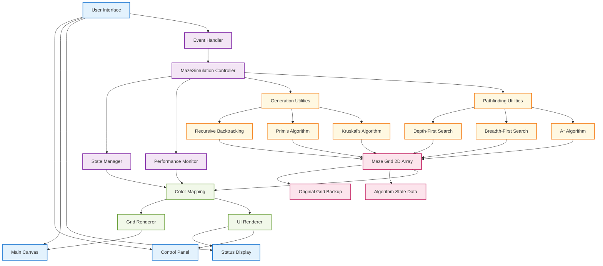

# 🎯 Maze Generation and Solving Simulation

A sophisticated, real-time interactive visualization of maze generation and pathfinding algorithms built with Python and Pygame. Watch algorithms come to life as they create intricate mazes and find optimal paths through them.


## 📚 Documentation

For a deep dive into the methodology and technical details, explore these comprehensive resources:

- [Technical Whitepaper](docs/technical_whitepaper.md) — In-depth explanation of the underlying methodology.
- [Model Architecture](diagrams/maze_architecture.mermaid) — Visual diagrams illustrating the system design.

## 📘 Additional Resources

- [**Developer Journey**](docs/dev-journey.md) — From a fleeting idea to a functioning system, this is a reflection on the creative process, the obstacles faced, and the persistence that shaped the final result.

## ✨ Features

### 🏗️ **Maze Generation Algorithms**
- **Recursive Backtracking**: Creates mazes with long, winding passages using depth-first exploration
- **Prim's Algorithm**: Generates mazes by randomly selecting walls from a frontier set
- **Kruskal's Algorithm**: Uses union-find data structure to create mazes by connecting disjoint sets

### 🧭 **Pathfinding Algorithms**
- **Depth-First Search (DFS)**: Explores paths deeply before backtracking
- **Breadth-First Search (BFS)**: Guarantees shortest path by exploring all neighbors level by level
- **A* Algorithm**: Optimal pathfinding using Manhattan distance heuristic for efficiency

### 🎨 **Visual Experience**
- **Real-time Animation**: Watch step-by-step algorithm execution
- **Modern UI Design**: Clean, professional interface with rounded corners and smooth colors
- **Dynamic Feedback**: Visual banners showing success/failure states
- **Color-coded Visualization**: Different colors for walls, paths, visited cells, and solutions
- **Responsive Design**: Fully resizable window with adaptive grid scaling

### 🎮 **Interactive Controls**
- **Instant Algorithm Switching**: Change algorithms on-the-fly
- **Real-time Statistics**: Track generation and solving steps
- **Performance Metrics**: Monitor execution time and efficiency

## 🏗️ System Architecture



## 🚀 Quick Start

### Prerequisites
- Python 3.7 or higher
- Pygame 2.0 or higher

### Installation

1. **Clone the repository:**
   ```bash
   git clone https://github.com/binayakbartaula11/maze-runner-sim.git
   cd maze-simulation
   ```

2. **Install dependencies:**
   ```bash
   pip install pygame
   ```
   
   Or using requirements.txt:
   ```bash
   pip install -r requirements.txt
   ```

3. **Run the simulation:**
   ```bash
   python maze_simulation.py
   ```

## 🎮 Controls & Usage

### Keyboard Shortcuts

| Key | Function | Description |
|-----|----------|-------------|
| `G` | **Generate Maze** | Create a new maze using selected algorithm |
| `S` | **Solve Maze** | Find path through maze using selected solver |
| `R` | **Reset** | Clear everything and start fresh |
| `1` | **Recursive Backtracking** | Switch to backtracking generation |
| `2` | **Prim's Algorithm** | Switch to Prim's generation |
| `3` | **Kruskal's Algorithm** | Switch to Kruskal's generation |
| `4` | **Depth-First Search** | Switch to DFS solving |
| `5` | **A* Algorithm** | Switch to A* solving |
| `6` | **Breadth-First Search** | Switch to BFS solving |

### Color Legend

| Color | Meaning |
|-------|---------|
| ⬛ **Black** | Wall cells (impassable) |
| ⬜ **White** | Open path cells |
| 🟢 **Green** | Start position |
| 🔴 **Red** | End/Goal position |
| 🔵 **Light Blue** | Visited cells during solving |
| 🟡 **Yellow** | Final solution path |
| 🟣 **Purple** | Current algorithm position |

## 🔧 Technical Architecture

### Core Components

```
MazeSimulation/
├── Grid Management
│   ├── 2D CellType enum array
│   ├── Dynamic resizing support
│   └── State preservation
├── Algorithm Engine
│   ├── Generation algorithms
│   ├── Solving algorithms
│   └── Step-by-step execution
├── UI System
│   ├── Modern sidebar design
│   ├── Real-time status updates
│   └── Responsive rendering
└── Event Handling
    ├── Keyboard controls
    ├── Window resizing
    └── Algorithm switching
```

### Algorithm Details

#### **Recursive Backtracking Generation**
- **Time Complexity**: O(n)
- **Space Complexity**: O(n)
- **Characteristics**: Creates mazes with long corridors and fewer dead ends
- **Method**: Uses a stack to track the current path and backtracks when no unvisited neighbors exist

#### **Prim's Algorithm Generation**
- **Time Complexity**: O(n log n)
- **Space Complexity**: O(n)
- **Characteristics**: Produces mazes with more branching and shorter dead ends
- **Method**: Maintains a frontier of walls and randomly connects cells to the growing maze

#### **Kruskal's Algorithm Generation**
- **Time Complexity**: O(n log n)
- **Space Complexity**: O(n)
- **Characteristics**: Creates mazes by connecting disjoint tree components
- **Method**: Uses union-find data structure to efficiently merge cell sets

#### **Depth-First Search (DFS)**

* **Time Complexity**: O(V + E)
* **Space Complexity**: O(V)
* **Characteristics**: Can get stuck in deep paths; does not guarantee the shortest path
* **Method**: Explores as far as possible along each branch before backtracking

#### **Breadth-First Search (BFS)**

* **Time Complexity**: O(V + E)
* **Space Complexity**: O(V)
* **Characteristics**: Guarantees shortest path in unweighted graphs
* **Method**: Explores all neighbors at the present depth before moving to the next level

#### **A* Search Algorithm*\*

* **Time Complexity**: O(b^d) (worst case), where `b` is branching factor and `d` is the depth of the solution
* **Space Complexity**: O(b^d)
* **Characteristics**: Efficient and optimal with an admissible heuristic
* **Heuristic Used**: Manhattan Distance → `|x1 - x2| + |y1 - y2|`
* **Method**: Combines cost-so-far and heuristic estimate to guide the search optimally


## 📊 Performance Metrics

The simulation tracks and displays:
- **Generation Steps**: Number of algorithm iterations to create maze
- **Solving Steps**: Number of cells explored during pathfinding
- **Execution Time**: Real-time performance measurement
- **Success Rate**: Visual feedback for solvable/unsolvable mazes

## 🛠️ Customization

### Grid Configuration
```python
# In maze_simulation.py
GRID_SIZE = 40          # Number of columns
CELL_SIZE = calculated  # Automatic based on window size
GRID_ROWS = calculated  # Automatic based on window height
```

### Visual Customization
```python
# Color scheme (RGB tuples)
SIDEBAR_BG = (35, 39, 46)      # Dark sidebar background
TITLE_COLOR = (255, 255, 255)  # White titles
ACTIVE_COLOR = (0, 180, 255)   # Blue for active states
SUCCESS_COLOR = (0, 220, 120)  # Green for success
```

### Performance Tuning
```python
FPS = 60                # Animation frame rate
WINDOW_WIDTH = 1280     # Default window width
WINDOW_HEIGHT = 800     # Default window height
```

## 🧩 Extending the Simulation

### Adding New Generation Algorithms

1. **Add to enum:**
   ```python
   class GenerationAlgorithm(Enum):
       YOUR_ALGORITHM = "Your Algorithm Name"
   ```

2. **Implement methods:**
   ```python
   def start_your_algorithm(self):
       # Initialize algorithm state
       pass
   
   def step_your_algorithm(self):
       # Execute one algorithm step
       pass
   ```

3. **Add to update loop:**
   ```python
   elif self.generation_algorithm == GenerationAlgorithm.YOUR_ALGORITHM:
       self.step_your_algorithm()
   ```

### Adding New Solving Algorithms

Follow the same pattern but use the `SolvingAlgorithm` enum and implement pathfinding logic.

## 📈 Educational Value

This simulation is perfect for:
- **Computer Science Students**: Understanding algorithm visualization
- **Educators**: Teaching graph theory and search algorithms
- **Developers**: Learning about real-time algorithm animation
- **Researchers**: Comparing algorithm performance characteristics

## 🐛 Troubleshooting

### Common Issues

**Slow Performance:**
- Reduce `FPS` constant for slower machines
- Decrease `GRID_SIZE` for better performance

**Display Issues:**
- Ensure Pygame is properly installed: `pip install --upgrade pygame`
- Try running in compatibility mode on older systems

**Memory Issues:**
- Large grid sizes may consume significant memory
- Recommended maximum grid size: 100x100

## 🤝 Contributing

We welcome contributions! Here's how to help:

1. **Fork the repository**
2. **Create a feature branch**: `git checkout -b amazing-feature`
3. **Make your changes** with clear, commented code
4. **Add tests** if applicable
5. **Submit a pull request** with detailed description

### Contribution Ideas
- New maze generation algorithms (Wilson's, Eller's, etc.)
- Additional pathfinding algorithms (Dijkstra, Jump Point Search)
- Performance optimizations
- UI/UX improvements
- Export functionality (save mazes as images)

## 📝 License

This project is licensed under the MIT License - see the [LICENSE](LICENSE) file for details.

## 🌟 Acknowledgments

- **Pygame Community** for excellent documentation and examples
- **Algorithm Visualizations** inspired by interactive learning platforms
- **Graph Theory Research** for pathfinding algorithm implementations

## 📚 References

- [Maze Generation Algorithms](https://en.wikipedia.org/wiki/Maze_generation_algorithm)
- [A* Search Algorithm](https://en.wikipedia.org/wiki/A*_search_algorithm)
- [Pygame Documentation](https://www.pygame.org/docs/)

## 📝 Citation

```bibtex
@misc{GHGPP2025,
  author = {Binayak Bartaula},
  title = {maze-runner-sim},
  year = {2025},
  publisher = {GitHub},
  url = {https://github.com/binayakbartaula11/maze-runner-sim}
}
```
