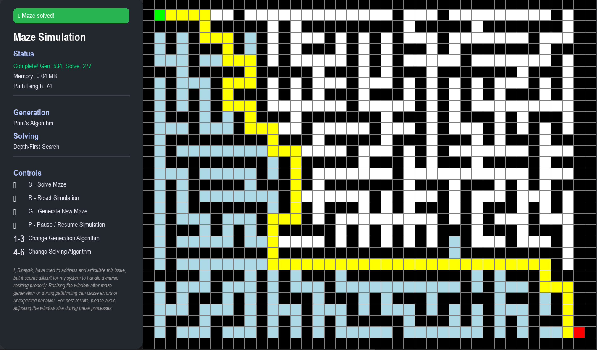

# Maze Runner Simulation (Enhanced)


A comprehensive, interactive educational platform for visualizing and analyzing maze generation and pathfinding algorithms. This project serves as both a learning tool for computer science students and a research platform for algorithmic performance analysis.



## 🚀 Key Features

### 🧩 Maze Generation
*   **Recursive Backtracking**: Generates "perfect" mazes with long winding corridors and no loops. Fully visualized for educational clarity.
*   **Prim's Algorithm**: Creates organic, spreading maze patterns with a balanced structure. Uses **batched visualization** for smooth performance.
*   **Kruskal's Algorithm**: Produces mazes with uniform connectivity and randomized structure. Optimized with **batched disjoint-set operations** to prevent UI freezing.

### 🔍 Pathfinding Algorithms
*   **Depth-First Search (DFS)**: Explores as far as possible along each branch before backtracking.
*   **Breadth-First Search (BFS)**: Guarantees the shortest path in an unweighted grid. Optimized with `collections.deque` for **O(1) performance**.
*   **A* Search (A-Star)**: Uses heuristics (Manhattan distance) to find the optimal path efficiently.

### 📊 Performance Analysis Framework
*   **Real-time Metrics**: Tracks execution time, step count, and peak memory usage (MB).
*   **Path Optimality**: Calculates the ratio between the found path and the optimal path ($\rho$).
*   **Automated Benchmarking**: Includes a headless benchmark suite (`benchmark.py`) to run hundreds of iterations and generate empirical data.
*   **Visual Reports**: Generates interactive HTML charts (`benchmark_report.html`) for easy analysis.
*   **Validated Results**: Empirical research confirms **A*** reduces node exploration by ~75% vs BFS and 67% vs DFS, with memory usage consistently < 0.15 MB.

## 🛠️ Installation

1.  **Prerequisites**: Ensure Python 3.8+ is installed.
2.  **Clone the Repository**:
    ```bash
    git clone https://github.com/binayakbartaula11/maze-runner-sim.git
    cd maze-runner-sim/v2_enhanced
    ```
3.  **Install Dependencies**:
    ```bash
    pip install -r requirements.txt
    ```

## 🎮 Usage

### Interactive Simulation
Launch the main application to visualize algorithms in real-time:
```bash
python maze_simulation.py
```

**Controls:**
*   `G`: Generate a new maze
*   `S`: Solve the current maze
*   `P`: Pause/Resume the simulation
*   `R`: Reset the grid
*   `1-3`: Switch Generation Algorithm (Backtracking, Prim's, Kruskal's)
*   `4-6`: Switch Solving Algorithm (DFS, A*, BFS)

### Automated Benchmarking
Run the benchmark suite to gather performance data:
```bash
python benchmark.py
```
*   **Output**:
    *   `benchmark_results.csv`: Raw dataset of all runs.
    *   `benchmark_report.html`: Interactive bar charts comparing Time, Steps, Memory, and Optimality.

## 📂 Project Structure

```text
v2_enhanced/
├── maze_simulation.py       # Core application with Pygame UI and algorithm logic
├── performance_analyzer.py  # Performance tracking module (Time, Memory, Steps)
├── benchmark.py             # Headless benchmarking suite with HTML reporting
├── requirements.txt         # Project dependencies
├── README.md                # This documentation
└── docs/
    └── technical_whitepaper/
        └── technical_whitepaper.md  # Detailed theoretical background and analysis
```

## ❓ Troubleshooting

**Q: The simulation is slow.**
A: Try reducing the grid size or closing other resource-intensive applications.

**Q: I get a `ModuleNotFoundError`.**
A: Make sure you have installed the dependencies using `pip install -r requirements.txt`.

**Q: The window is too small/large.**
A: You can resize the window, and the grid will automatically adjust.

## 📝 Technical Documentation

For a deep dive into the algorithmic complexity, implementation details, and theoretical background, please refer to the [Technical Whitepaper](docs/technical_whitepaper/technical_whitepaper.md).

## 🤝 Contributing

Contributions are welcome! Please feel free to submit a Pull Request.

1.  Fork the project
2.  Create your feature branch (`git checkout -b feature/AmazingFeature`)
3.  Commit your changes (`git commit -m 'Add some AmazingFeature'`)
4.  Push to the branch (`git push origin feature/AmazingFeature`)
5.  Open a Pull Request

## 📄 License

Distributed under the MIT License. See `LICENSE` for more information.

## 🌟 Acknowledgments

*   **Pygame Community** for excellent documentation and examples.
*   **Algorithm Visualizations** inspired by interactive learning platforms.
*   **Graph Theory Research** for pathfinding algorithm implementations.

## 📚 References

*   [Maze Generation Algorithms](https://en.wikipedia.org/wiki/Maze_generation_algorithm)
*   [A* Search Algorithm](https://en.wikipedia.org/wiki/A*_search_algorithm)
*   [Pygame Documentation](https://www.pygame.org/docs/)

## 📝 Citation

```bibtex
@misc{GHGPP2025,
  author = {Binayak Bartaula},
  title = {maze-runner-sim},
  year = {2025},
  month = {December},
  publisher = {GitHub},
  url = {https://github.com/binayakbartaula11/maze-runner-sim}
}
```
